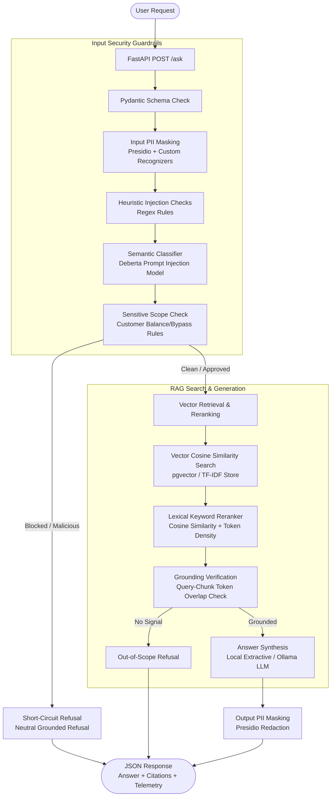

# ttb Policy Assistant

Production-style take-home implementation of a small Retrieval-Augmented Generation service for synthetic bank policy questions.

## Scope

The exam brief referenced a provided synthetic policy corpus and evaluation set, but those files were not included in the folder. I created an obviously synthetic corpus in `policies/` and a reproducible evaluation set in `data/eval/`. No real customer, employee, bank-confidential data, or secrets are used.

## Architecture




The primary Docker path uses PostgreSQL with pgvector, matching the exam requirement to chunk, embed, and index into a vector store. The answer synthesis is still deterministic and local, so no OpenAI or Azure key is required. A TF-IDF fallback remains available for fast local tests and offline debugging.

## Chunking Strategy

The corpus uses short, structured Markdown policy documents with clear headings, so the chunker splits by Markdown sections instead of fixed token windows. Each chunk keeps its source document, section title, and stable chunk ID for citations.

Token overlap is intentionally not used by default. For this corpus, section-aware chunks preserve semantic boundaries and keep citations cleaner. Overlap is more useful for books, long PDFs, transcripts, or poorly structured text where an answer may cross an arbitrary chunk boundary. If the corpus later includes long unstructured documents, the next step would be paragraph or token-window splitting with a small overlap, for example 10-20%.

## Run With Docker

```bash
docker compose up --build
```

The Compose API service bind-mounts `app/`, `data/`, and `scripts/` and runs
Uvicorn with `--reload`, so Python code and local data edits are picked up
without rebuilding. Rebuild only when `requirements.txt`, `Dockerfile`, or
Compose dependency settings change.

Open:

```text
http://127.0.0.1:8000/docs
```

This single command starts:

- PostgreSQL with the pgvector extension
- the FastAPI service
- automatic schema creation
- automatic policy chunking, embedding, and ingestion when the table is empty

The first build can take several minutes because Docker installs Python dependencies and downloads the local embedding model:

```text
intfloat/multilingual-e5-base
```

E5 is retrieval-oriented and multilingual. The implementation embeds stored policy chunks with the `passage:` prefix and user questions with the `query:` prefix, as recommended by the E5 model card. The pgvector column uses `vector(768)`, matching `multilingual-e5-base`.

If you previously started this project with the old 384-dimensional demo model, reset the local Postgres volume once before rebuilding:

```bash
docker compose down -v
docker compose up --build
```

Health check:

```bash
curl http://127.0.0.1:8000/health
```

Ask a question:

```bash
curl -X POST http://127.0.0.1:8000/ask ^
  -H "Content-Type: application/json" ^
  -d "{\"question\":\"How many annual leave days do full-time employees receive?\",\"top_k\":3}"
```

Ask with local Ollama answer generation:

```bash
curl -X POST http://127.0.0.1:8000/ask ^
  -H "Content-Type: application/json" ^
  -d "{\"question\":\"How many annual leave days do full-time employees receive?\",\"top_k\":3,\"llm_provider\":\"ollama\"}"
```

When running through Docker Compose, the API container calls Ollama on your host at:

```text
http://host.docker.internal:11434
```

Make sure Ollama is running locally and the model exists before using `llm_provider`:

```bash
ollama pull qwen3.5:4b
ollama serve
```

The Docker Compose profile keeps the Ollama model warm for 5 minutes and sends only
the top reranked policy chunk to the local model by default. These settings keep
local LLM latency lower while preserving deterministic retrieval and citations:

```text
TTB_OLLAMA_KEEP_ALIVE=5m
TTB_OLLAMA_NUM_PREDICT=80
TTB_OLLAMA_NUM_CTX=1024
TTB_OLLAMA_CONTEXT_TOP_K=1
```

## Local Fallback Mode

For fast local development without Docker or model downloads, use the TF-IDF fallback:

```bash
python -m venv .venv
.venv\Scripts\activate
pip install -r requirements.txt
$env:TTB_RETRIEVAL_BACKEND="tfidf"
uvicorn app.main:app --reload
```

This mode is useful for unit tests and debugging, but the Docker Compose path is the pgvector implementation intended for exam review.

## Tests

```bash
pytest
pytest --cov=app --cov-report=term-missing --cov-fail-under=80
```

The tests cover:

- Markdown chunking and metadata
- PII redaction
- prompt-injection refusal
- out-of-scope sensitive-data refusal
- `/ask` integration behavior
- request validation
- optional pgvector upsert/search integration when `TTB_TEST_DATABASE_URL` is set
- IP-based rate limiting
- metrics output

## Evaluation Harness

```bash
python scripts/run_evaluation.py
```

The harness runs 15 grounded questions and 7 adversarial questions, then prints answer, citation, expected-term, refusal, and retrieval-score summaries. It exits non-zero unless the configured thresholds pass, so it can be used as a CI regression gate. It also writes a machine-readable report to `data/eval/latest_results.json`, which is ignored by git. Current expected local result is 15/15 grounded answers, 15/15 citation hits, at least 12/15 expected-term hits, and 7/7 adversarial refusals.

## API

`POST /ask`

Request:

```json
{
  "question": "Can employees connect personal USB drives to bank devices?",
  "top_k": 3
}
```

Response:

```json
{
  "success": true,
  "answer": "...",
  "citations": [
    {
      "document": "policy_07_it_acceptable_use.md",
      "chunk_id": "policy_07_it_acceptable_use.md:004",
      "section": "4. External Storage and Media Restrictions"
    }
  ],
  "guardrails": {
    "redacted_input": false,
    "redacted_output": false,
    "refused": false,
    "reason": null
  },
  "telemetry": {
    "request_id": "...",
    "latency_ms": 1,
    "input_tokens": 9,
    "output_tokens": 44,
    "retrieved_chunks": 3
  }
}
```

Optional request fields:

```json
{
  "llm_provider": "ollama"
}
```

If `llm_provider` is omitted, the service uses the deterministic extractive answer generator. Currently `ollama` is the only accepted LLM provider. The model is configured by `TTB_OLLAMA_DEFAULT_MODEL`. Ollama generation uses a compact `/api/chat` prompt with bounded output by default; tune `TTB_OLLAMA_NUM_PREDICT`, `TTB_OLLAMA_NUM_CTX`, and `TTB_OLLAMA_CONTEXT_TOP_K` if you prefer longer answers over lower latency.

`TTB_RATE_LIMIT_PER_MINUTE` controls the lightweight in-memory IP-based request limiter for `/ask`; this is not a user identity or per-user quota. Production should use authenticated user/service identity plus an API gateway or shared store such as Redis for distributed rate limiting.

## Guardrails

Implemented guardrails:

- Validates `/ask` payloads with Pydantic, including question length, non-blank content, `top_k`, and supported `llm_provider` values.
- Redacts PII with Presidio before retrieval and after answer generation.
- Adds custom Presidio recognizers for phone numbers, national IDs, card-like numbers, and bank/customer/account/staff identifiers.
- Uses a local prompt-injection classifier configured by `TTB_PROMPT_INJECTION_MODEL` and `TTB_PROMPT_INJECTION_THRESHOLD`; Docker defaults to the public `ProtectAI/deberta-v3-base-prompt-injection` model.
- Warms the prompt-injection classifier during FastAPI startup, so the first real `/ask` request does not pay model load time. `/health` includes `guardrails_ready`.
- Refuses prompt-injection requests such as revealing hidden/system prompts.
- Refuses customer-specific account or balance questions.
- Refuses requests to bypass approval or policy controls.
- Refuses when retrieval confidence is below the configured threshold.
- Fails closed with `guardrail_unavailable` if a required guardrail component cannot safely evaluate a request.
- Applies a configurable in-memory IP-based rate limit to `/ask`.
- Logs redacted request metadata rather than raw sensitive values.
- Returns `X-Request-ID` and includes request IDs in structured logs for correlation.

## Observability

The service writes structured JSON logs for refusals and completed requests, including:

- request ID
- latency
- estimated input/output token counts
- retrieved chunk count
- refusal status and reason
- retrieval scores and cited chunk IDs
- guardrail stage timings for input PII redaction, prompt-injection detection,
  deterministic rule checks, and output PII redaction

The service also exposes `GET /metrics` in Prometheus text format with request count, refusal counts by reason, average latency, and the active retrieval backend.

## Secrets and AI Providers

No AI API keys are required. No secrets are committed.

Docker Compose uses a local development database password default through environment interpolation. In a real deployment this would come from a secret manager or deployment environment, not source-controlled compose defaults.

No real API keys, model provider keys, or production database passwords are committed.

Optional provider variables are documented in `.env.example` for future use only:

```text
OPENAI_API_KEY
AZURE_OPENAI_API_KEY
AZURE_OPENAI_ENDPOINT
AZURE_OPENAI_DEPLOYMENT
```

If real LLM generation were added, the retrieval and guardrail layers would remain outside the model call, and the model would receive only redacted input plus retrieved policy context.

Local Ollama generation is supported without API keys. It is optional per request. Guardrails, retrieval, out-of-scope checks, output redaction, and citations still run outside the LLM. The LLM receives only the redacted user question and retrieved policy chunks.

## Retrieval Backends

`TTB_RETRIEVAL_BACKEND=pgvector`

- Used by `docker compose up --build`
- Embeds chunks with `intfloat/multilingual-e5-base`
- Stores chunk text, metadata, and `vector(768)` embeddings in PostgreSQL
- Searches with pgvector cosine distance using `<=>`
- Uses an HNSW index with `vector_cosine_ops`

`TTB_RETRIEVAL_BACKEND=tfidf`

- Used by local tests by default
- Requires no database
- Provides deterministic fallback retrieval

## Trade-Offs

- Used pgvector over Azure AI Search or FAISS because PostgreSQL is a common corporate operational baseline and keeps chunk text, metadata, and embeddings together.
- Used `intfloat/multilingual-e5-base` because it is retrieval-oriented, multilingual, and lighter than larger 1024-dimensional alternatives like BGE-M3 or multilingual E5 large.
- Kept TF-IDF retrieval as a fallback so local tests can run without Docker or model downloads.
- Used deterministic answer synthesis instead of external LLM calls so the project can be evaluated without private keys.
- Implemented a lightweight eval harness with citation and term checks instead of an LLM judge.
- Used an in-memory IP-based rate limiter to demonstrate stabilization controls without making local review harder. A real deployment should enforce identity-aware access and distributed rate limiting.

## Rubric Coverage

| Requirement | Evidence |
| --- | --- |
| Ingest, chunk, embed, index | `app/chunking.py`, `app/embeddings.py`, `app/stores/pgvector_store.py`, `scripts/ingest_policies.py`, `docker-compose.yml` |
| Retrieval + grounded generation | `app/rag.py`, `app/generation.py`, structured citations and inline chunk IDs |
| HTTP API and validation | `app/main.py`, `app/schemas.py`, `tests/test_ask_api.py` |
| Guardrails | `app/guardrails.py`, `tests/test_guardrails.py`, adversarial eval set |
| Observability | `app/logging_config.py`, `app/observability.py`, response telemetry, `GET /metrics` |
| Tests and CI | `tests/`, `.github/workflows/ci.yml`, coverage gate, pgvector CI service, dependency audit |
| Eval harness | `scripts/run_evaluation.py`, `data/eval/eval_questions.json`, `data/eval/adversarial_questions.json` |
| Docker run path | `Dockerfile`, `docker-compose.yml` |
| Docs and judgment | README, `docs/ADR-001-rag-architecture.md`, `docs/threat-model.md`, `docs/slo-runbook.md` |

## What I Would Do With More Time

- Add Azure AI Search behind the same retrieval interface.
- Add optional OpenAI/Azure OpenAI answer generation with strict context-only prompting.
- Add support for bilingual policy corpora and multilingual embedding models if required by future scope expansion.
- Add linting and static type checks to CI.
- Replace IP-based in-memory rate limiting with identity-aware Redis or API gateway limits for multi-instance deployments.
- Add the bank's standard identity-aware service authentication.

## Operational Notes

- [RAG Architecture ADR (ADR-001)](docs/ADR-001-rag-architecture.md)
- [Security Guardrails ADR (ADR-002)](docs/ADR-002-security-guardrail-layer.md)
- [Threat model](docs/threat-model.md)
- [SLO and runbook](docs/slo-runbook.md)

## AI-Assisted Development Disclosure

I utilized an AI assistant as a pair-programmer and research partner throughout the lifecycle of this project. The collaboration spanned the following areas:

* **Research & Tool Selection:** Used AI to compare and contrast vector backends (e.g., PostgreSQL + pgvector vs. FAISS) and security/guardrail tools (specifically researching Microsoft Presidio for PII redaction and Hugging Face classifier models for prompt injection vs. regex-only options).
* **Planning & Architecture:** Assisted in structuring the implementation plan, designing the multi-stage guardrail pipeline boundaries, and drafting the synthetic policy corpus.
* **Code Implementation:** Scaffolded the core implementation code, including the FastAPI routes, pgvector database logic, and the optimized guardrail engine (including Presidio initialization and Deberta prompt-injection classifier integration).
* **Testing & Coverage:** Scaffolded the unit and integration test suites to ensure high test coverage (exceeding the 80% threshold), which was subsequently verified and refined through manual testing.

All generated code, patterns, and architectural decisions were reviewed, debugged, and integrated by me. No bank-confidential data, real PII, or credentials were shared with any external AI models.
