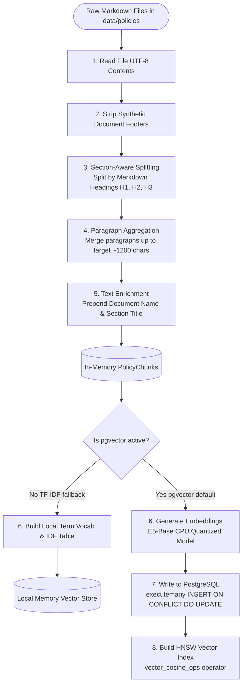

# ADR-001: RAG Architecture

* **Status:** Implemented
* **Date:** 2026-06-25
* **Authors:** Mawin Srichat

---

## Context and Problem Statement

The take-home requires a small policy assistant that can run on a clean machine, answer from synthetic policy documents, cite sources, and avoid reliance on private cloud keys.

## Decision Drivers

* **Portability:** Must run locally on a clean machine without complex cloud dependencies.
* **Reproducibility:** Evaluation and testing need to produce identical results across environments.
* **Offline Debugging:** Ability to test the pipeline without internet access or LLM endpoint configurations.

## Considered Options

* **Option 1: Hosted LLMs & Vector Databases (e.g., OpenAI + Azure AI Search)** — Dropped due to the requirement for private API keys and cloud subscription dependencies during evaluation.
* **Option 2: Pure Local LLM RAG (e.g., Local pgvector + Local Ollama generator)** — Good, but requires download of large models which can take minutes or fail on limited machines during initial tests.
* **Option 3: Hybrid local pgvector with TF-IDF fallback and extractive generator (Selected)** — Allows pgvector + SentenceTransformers for production-style runs, and TF-IDF fallback + extractive generation for fast, zero-dependency testing.

## Decision Outcome

We chose **Option 3**. The FastAPI service loads pgvector by default when running under Docker Compose, but falls back to local TF-IDF vectorization and sentence-level extractive answer generation when running tests or in offline mode.

### Data Ingestion & Vector Store Creation Pipeline

### Rationale

* **Unified Datastore:** pgvector keeps chunk text, metadata, and embeddings together in a unified operational database.
* **Multilingual Capability:** `intfloat/multilingual-e5-base` is highly retrieval-oriented, lightweight, and supports future Thai/English bilingual operations.
* **Deterministic Baseline:** Deterministic extraction ensures reproducible answers during evaluation tests without needing cloud OpenAI keys.
* **Vendor Decoupling:** Optional Ollama queries remain available per request, demonstrating decoupling of the LLM generation provider.

## Consequences

* **Good:** Latency is extremely low (<500ms on TF-IDF mode).
* **Good:** 100% reproducible tests and evaluation runs.
* **Good:** Production database layout (pgvector with HNSW index) is maintained.
* **Bad:** The default extractive fallback produces rigid, less natural answers compared to generative LLMs.
* **Mitigation:** Allow optional Ollama LLM queries via request payload parameters, and document an OpenAI/Azure OpenAI deployment roadmap.

## References

* **Security Guardrails:** See [ADR-002: Security Guardrail Layer](ADR-002-security-guardrail-layer.md) for detail on safety filters and injection protections.
* **Threat Mitigation:** See [Threat Model](threat-model.md) for mapping security risks to pipeline controls.
* **Operations:** See [SLO and Runbook](slo-runbook.md) for runbook guides and quality evaluation gates.

