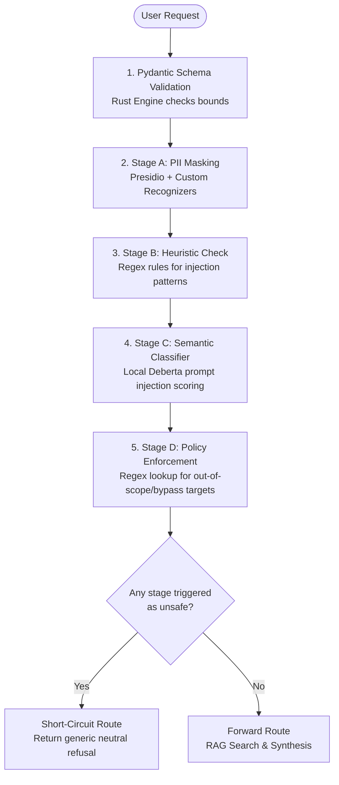

# ADR-002: Implementation of a Low-Cost, High-Performance Security Guardrail Layer for Corporate Policy RAG

* **Status:** Implemented
* **Date:** 2026-06-26
* **Authors:** Mawin Srichat

---

## Context and Problem Statement

The corporate policy RAG system must process user queries efficiently while strictly adhering to data security and privacy requirements. The system must prevent data leaks (PII) and remain resilient against malicious behavioral attacks (prompt injections, instruction overrides, or policy bypass attempts).

Traditional LLM-as-a-judge approaches for checking safety introduce significant network latency (often >500ms) and high token-billing costs. The goal is to implement an input defense pipeline that achieves **maximum execution performance (sub-35ms overhead) at zero runtime infrastructure cost**.

## Decision Drivers

* **Performance:** Minimizing time-to-first-token by short-circuiting malicious queries early.
* **Cost:** Avoid dependency on heavy, hosted LLM guard models that scale costs linearly with usage.
* **Security & Compliance:** Meeting strict data privacy rules by stripping PII before raw text hits downstream models or vector search layers.
* **Simplicity & Readability:** Designing a clean, sequential middleware pattern that respects the **DRY (Don't Repeat Yourself)** principle.

## Considered Options

* **Option 1: LLM-Based Safety Gateways (e.g., Llama Guard 8B)** — Dropped due to high GPU/VRAM hardware costs and slow runtime generation.
* **Option 2: Pure Regex Engine** — Dropped because regex alone cannot catch semantic variations of novel prompt injections.
* **Option 3: Hybrid Deterministic & Lightweight Classifier Engine (Selected)** — Uses Rust-backed validation, optimized regex patterns, and tiny local scoring models to balance accuracy, cost, and speed.

## Decision Outcome

We chose **Option 3**. The architecture enforces a sequential check pipeline that executes fast, low-compute validations first, allowing the system to fail closed immediately if an early rule triggers.

### Architectural Diagram

### Chosen Execution Lifecycle

1. **`/ask` API Schema Validation:** Leverages **Pydantic V2** (powered by a native Rust engine) to ensure the request is structurally sound, non-blank, and contains at least 3 characters.
2. **Deterministic Input Guardrail (Sequential Execution):**
   * **Step A (PII Masking):** **Microsoft Presidio** combined with optimized custom regex recognizers anonymizes structural text patterns (e.g., Employee IDs, emails) on local CPU threads.
   * **Step B (Heuristic Check):** Evaluates deterministic prompt-injection regex rules targeting common structural overrides (e.g., `ignore previous instructions`).
   * **Step C (Semantic Classification):** Executes a tiny local classification head or microscopic model (e.g., a sub-100M parameter model via ONNX runtime) to catch semantic jailbreaks.
   * **Step D (Policy Enforcement):** Runs final fast regex match rules to scan for sensitive keyword or corporate policy-bypass behaviors.

3. **Safe Failure Mode Routing:** If any layer flags the input as unsafe, the middleware short-circuits execution and returns a generic, neutral refusal text immediately, bypassing vector database lookups and downstream inference entirely.

## Consequences

* **Good:** Latency overhead is minimized to sub-35ms total per request.
* **Good:** Infrastructure costs are effectively **$0**, as the entire guardrail runs on the host machine's existing CPU allocation.
* **Good:** Sensitive internal system prompts and backend code secrets are never exposed to malicious end-users due to uniform catch-all exception blocks.
* **Bad:** The static regex components require periodic updating as corporate compliance policies change or new common bypass phrases emerge.
* **Mitigation:** Maintain standard, decoupled regex rule lists separate from core pipeline logic to allow seamless hot-swapping of policy patterns.

## References

* **RAG Architecture:** See [ADR-001: RAG Architecture](ADR-001-rag-architecture.md) for retrieval and vector storage details.
* **Threat Mitigation:** See [Threat Model](threat-model.md) for risk controls mapped to this guardrail layer.
* **Operations:** See [SLO and Runbook](slo-runbook.md) for guardrail metrics, safety targets, and runbooks.

