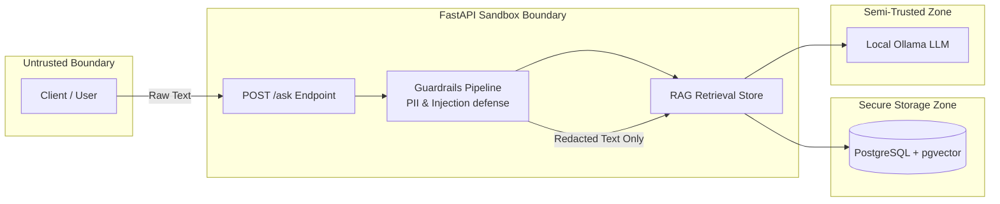

# Threat Model

## Trust Boundary & Data Flow Diagram

## Assets

- Synthetic policy corpus and embeddings.
- Staff questions submitted to `/ask`.
- Logs and telemetry.
- Optional provider configuration and database credentials.

## Main Risks And Controls

| Risk | Control |
| --- | --- |
| Prompt injection asks for hidden prompts or rule overrides | Regex refusal before retrieval, context-only system prompt for optional LLM generation, adversarial eval questions |
| Customer-specific account or balance lookup | Sensitive out-of-scope refusal before retrieval |
| PII in user input or generated output | Input and output redaction for emails, phones, Thai ID-like values, labeled IDs, long numbers, and card-like numbers |
| Sensitive values in logs | Structured logs use request metadata, refusal reason, chunk IDs, scores, and token counts rather than raw questions |
| Poisoned or misleading policy chunks | Synthetic corpus only for take-home; production needs source review, document signing, ingestion audit logs, and rollback |
| Dependency or model supply-chain issue | Pin dependencies, run CI, and run dependency audit in CI |
| Expensive abuse of `/ask` | Configurable in-memory IP-based rate limiting for take-home; production should use authenticated identity plus API gateway or Redis-backed limits |
| Unauthenticated internal use | `/ask` is intentionally open for local review; production should use standard identity-aware service authentication |

## Out Of Scope For This Take-Home

- Real bank data.
- Customer account systems.
- Production secret manager integration.
- Fine-grained authorization and identity provider integration.

## References

- See [ADR-001: RAG Architecture](ADR-001-rag-architecture.md) for data flow and retrieval setup.
- See [ADR-002: Security Guardrail Layer](ADR-002-security-guardrail-layer.md) for implementation specifications on input defenses and threat counters.
- See [SLO and Runbook](slo-runbook.md) for operational targets and safety runbooks.
